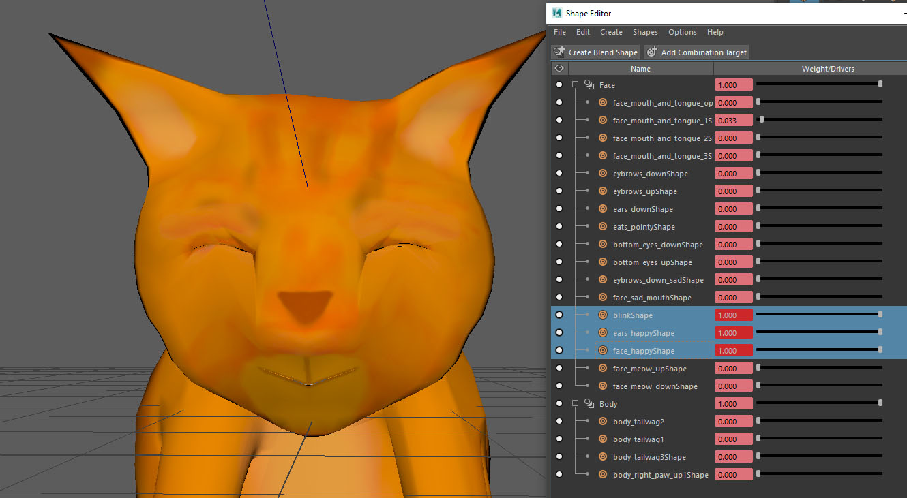

# CatAnimation
For this project I wanted to try an animate a cat, make it cute and get some emotions as well. 
Since I was not comfortable using rigging I used blend shapes to get the animation to work.  
 
 
 Puss in Boots was an inspiration when modeling and coloring this cat.
    
 
  

Full video: 

