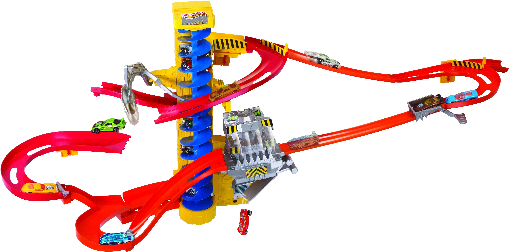

Chain Reaction
The objective of this project was for me to try out some basic animation. 
I achieved the animation by changing the objects position at each time frame and ajusting them to easyin, easyout,hard drop, etc, depending on how the object moved. 
Part of the inspiration for this project came from the following inmage, then the rest I added to make it a continuous loop: 

Since I was just starting animation I was not able get the a good water animation, but I improvised by have donut shaped models move up adn down
