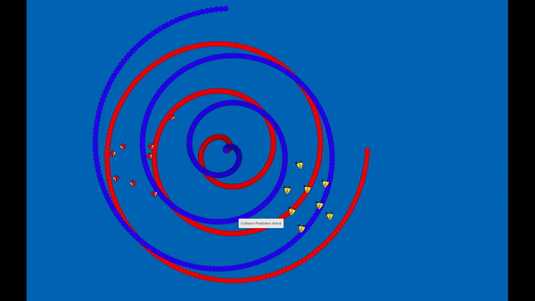
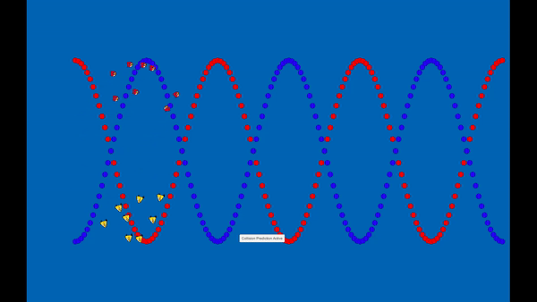

# Game AI Collision Avoidance

Collaboration with:
Igor Carvalho 
Jeremy Torella
Enoch Huang

This game has the AI stay in a loose formation and path follow along with perform collision prediction or collision avoidancce. 
For the path follow algorithm the formation just follows the path set for them in the form of the dots. The red birds follow the blue dots while te yellow birds follow the red dots.  
For collision prediction, each bird takes into account the other's position adn velocity to calculate and avoid a posible collision.  
For cone checking, each bird only checks for a posible collision in a small cone shape infront of them.  
As shown below, the collision prediction algorithms works better as the birds are able to continue path following while moving through each other in a smoother transition.  

  
