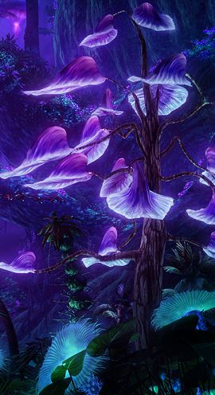
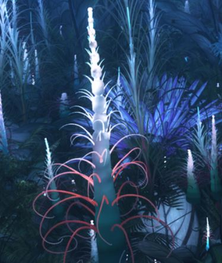
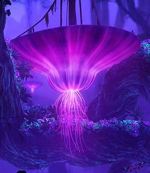
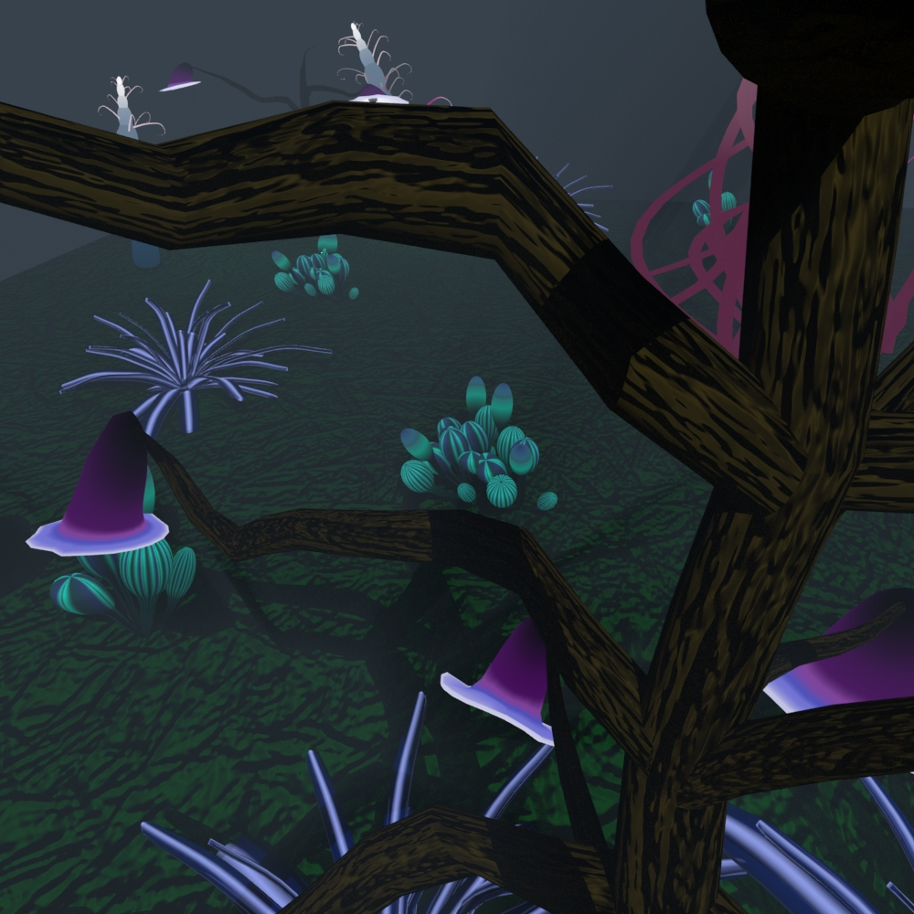
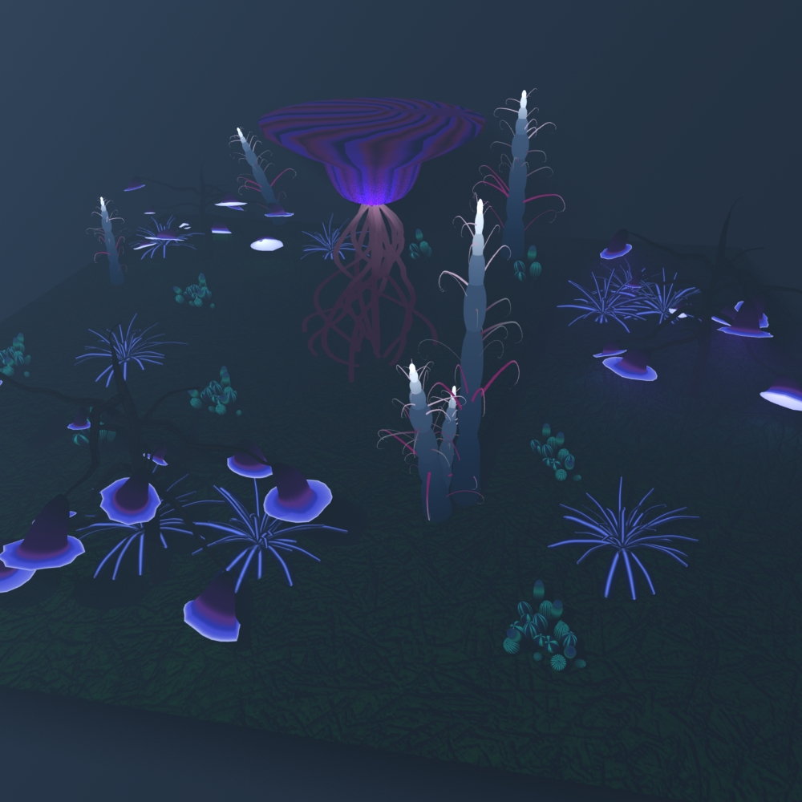

# Garden
The idea of this project was to model the forest similar to the movie Avatar. 
I was able to accomplish this using Arnold Render, a light fog, and mixing meshlighting with one main light to represent a moon/sun. 

The following are some pictures I used for inspiration: 
  

These are some images from my project: 
   
