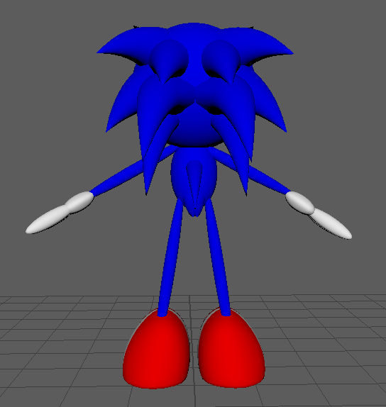

# Projects: 
### Chain Reaction 
+ Maya based project using animation to cause a chain reaction.
   

### Garden 
+ Maya based project using lighing and Mesh lighting to create a pandora-like garden. 
  

### SonicAnimation 
+ Simple project used when I was first learning how to rig using Maya. 
   
