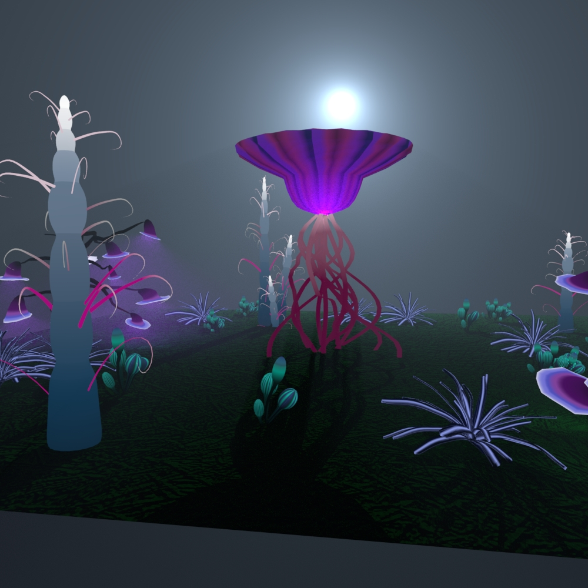
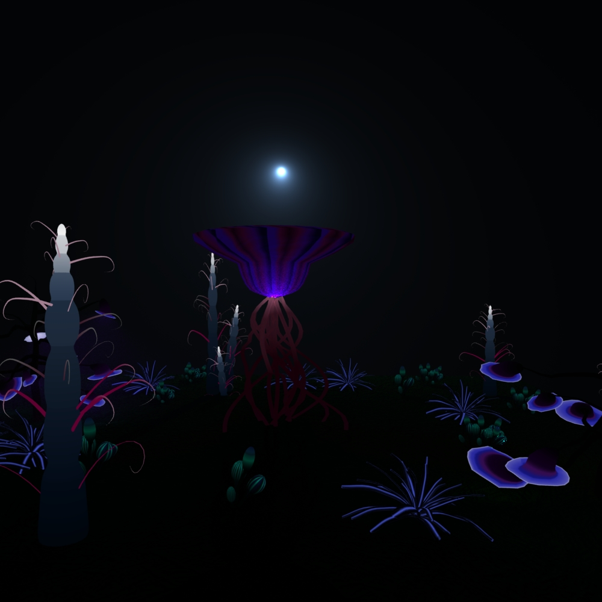
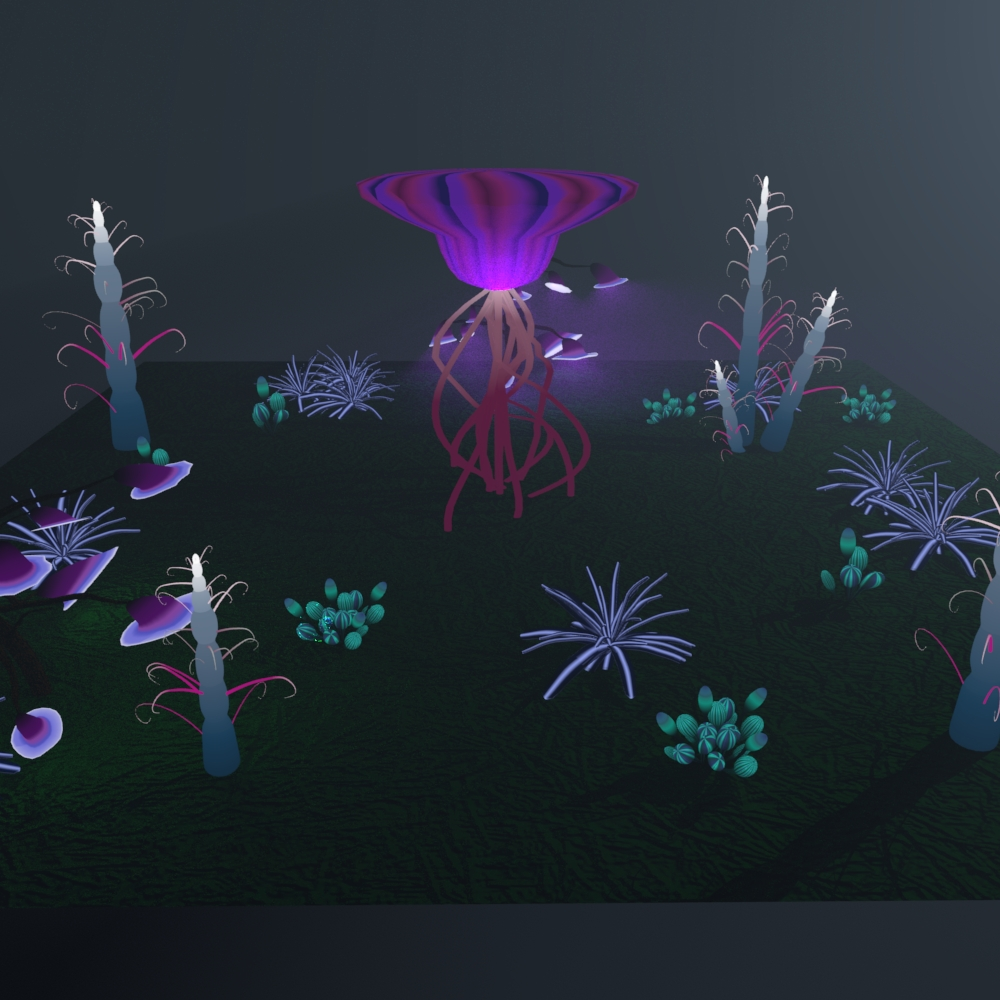

# Projects: 

### Garden 
+ Maya based project using lighting and Mesh lighting to create a pandora-like garden. 
  

### Cat Animation 
+ Trying to get emotions and different features of a cat using blendshapes in Maya. 
      
  

Full video: 
          

### Chain Reaction 
+ Maya based project using animation to cause a chain reaction.
   

### Sonic Animation 
+ Simple project used when I was first learning how to rig using Maya. 
   

### Pacman 
+ Pacman game made out of unity.  
 

### Live Coding 
Solo act using The Force by Shawn Lawson. 

### MDP Tower Defence Game 
+ Unity based project where my team programmed an AI to play our tower defence game using MDP. 
 

### Dynamic Movement 
+ Unity based project where my team programmed two AIs, one that does pathfinding and dynamic evade while the other dynamicly wanders, pursues and arrives. 
 

### Collision Avoidance 
+ Unity based project for a formation that path follows, collision preditics, and cone checks. 
  

### Path Finding 
+ Unity based project that does text based map generating, tile based path finding, waypoint path finding, eudlidian and manhatan pathfinding.  
  
